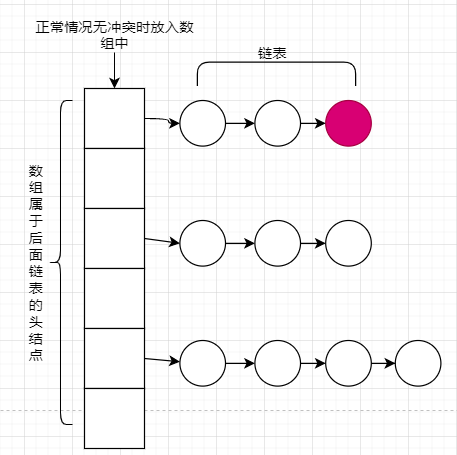

# Java 容器 笔记
---

## 第一章 Collection
集合类
在多线程的程序中少考虑使用 List ，首先考虑使用Queue 和 set 。
***List和Queue的最大的区别是什么。Queue提供好多和多线程有关的api。offer peek poll put take等方法***

### 1.1 List->Vector
`Vector`一个比较老的集合类，里面所有的方法都增加了synchronize
***线程安全***
``` java
//源码
public synchronized int size() {
    return elementCount;
}
```

缺点：
- 锁粒度比较大
- 性能稍差（并发较低时并不一定会很差）

### 1.2 List->ArrayList
***非线程安全***
在多线程移除或添加元素时存在数据不一致的问题

### 1.3 List->CopyOnWriteArrayList
写时复制，底层实现是使用的写时将原来值拷贝一份到另外一个变量中，然后写完后将原来的引用指向到当前新结果

- 读不加锁（除了读不加锁剩下都加锁）
- 写加锁，使用的是 ReentrantLock 重入锁（JDK1.8）
``` java
//写加锁源码
public boolean add(E e) {
    //ReentrantLock 重入锁，底层AQS实现
    final ReentrantLock lock = this.lock;
    lock.lock();
    try {
        Object[] elements = getArray();
        int len = elements.length;
        //写时复制体现，将newElements重新setArray
        Object[] newElements = Arrays.copyOf(elements, len + 1);
        newElements[len] = e;
        setArray(newElements);
```
> 使用场景：读特别多，写特别少时使用

### 1.4 LinkedQueue->ConcurrentLinkedQueue
java 并发包中提供的Queue
***线程安全*** 底层使用CAS来实现线程安全
``` java 
public E poll() {
    restartFromHead:
    for (;;) {
        for (Node<E> h = head, p = h, q;;) {
            E item = p.item;
            if (item != null && p.casItem(item, null)) {
                // Successful CAS is the linearization point
```

使用方法
``` java
// 有序存入使用 add 无序存入使用 offer
//tikes.offer(i);
tikes.add(i);

//取出并删除使用 poll ,只取出不删除使用 peek
Integer item = tikes.poll();
//Integer item = tikes.peek();
```

### 1.5 BlockingQueue->LinkedBlockingQueue
无界队列，其最大的值为Integ的最大值
他是天生的适配多线程模型下的生产者消费者模型的一个队列
`LinkedBlockingQueue` 会在队列满了或者空了后直接阻塞
底层使用的ReentrantLock 的 Condition 来实现阻塞，再给最底层走使用的LockSupport.park()来实现阻塞的

``` java
//无界队列，默认是Integer的最大值 2的31次方
public LinkedBlockingQueue(Collection<? extends E> c) {
    this(Integer.MAX_VALUE);
//源码片段
public void put(E e) throws InterruptedException {
        
        //数据结构为双向链表 node 
        Node<E> node = new Node<E>(e);
        //底层使用的 ReentrantLock 重入锁
        final ReentrantLock putLock = this.putLock;
        //原子类来定义其队列的大小
        final AtomicInteger count = this.count;
        putLock.lockInterruptibly();
        try {
            //队列满了就等待
            while (count.get() == capacity) {
                //Condition 对象
                notFull.await();
            }
            enqueue(node);
            c = count.getAndIncrement();
            if (c + 1 < capacity)
                notFull.signal();
```

### 1.6 BlockingQueue->ArrayBlockingQueue
有界队列

add 时如果队列满了就会报异常 
put 和 offer 如果队列满了会阻塞等待 底层实现用了ReentrantLock Condition
``` java
// 源码片段
//add 方法底层实现 抛出异常
public boolean add(E e) {
    if (offer(e))
        return true;
    else
        throw new IllegalStateException("Queue full");
}

//put offer 底层实现
public void put(E e) throws InterruptedException {
    checkNotNull(e);
    final ReentrantLock lock = this.lock;
    lock.lockInterruptibly();
    try {
        while (count == items.length)
        // Condition 体现
        notFull.await();
```

### 1.7 BlockingQueue->DelayQueue
延迟(Delay)队列

队列中的元素可以按照时间排序，最小时间的排在最上面，使用`DelayQueue`,需要重写compareTo(排序)方法
> 使用场景：按照时间进行的计划任务

### 1.8 PriorityQueue
优先(Priority)队列

内部可排序队列，默认升序
数据结构：二叉树

### 1.9 SynchronousQueue
同步传递队列，队列长度为0，此队列里面不可以存放数据，可以实现线程间的手递手传递
参与传递的两个线程如果有任何一方未准备好都会是对方处于阻塞等待状态，等到两方都准备好后开始传递数据
``` java
SynchronousQueue<String> synchronousQueue = new SynchronousQueue();

new Thread(() -> {
    try {
        //获取数据
        System.out.println(synchronousQueue.take());
    } catch (InterruptedException e) {
        e.printStackTrace();
    }
}).start();
//传递数据
synchronousQueue.put("给你的优乐美");
```

### 1.20 TransferQueue
传输等待队列，可以实现线程间的手递手传递
传输给对方，如果对方未接受到就一直等待，等到对方接受完毕后方可执行下面的逻辑，类似于MQ的ACK模型。
``` java
TransferQueue transferQueue = new LinkedTransferQueue();

new Thread(() -> {
    try {
        //确认完毕后原线程继续往下执行
        System.out.println("我拿到了"+transferQueue.take());
    } catch (InterruptedException e) {
        e.printStackTrace();
    }
}).start();

try {
    //传输到队列等待别人确认
    transferQueue.transfer("你的优乐美");
```


## 第二章 Map
**<font color="red">2.1-2.4章内容都是在10个线程同时给map中放入1千万总量的UUID和一个线程读1千万次的测试结果</font>**
map的演变历程大概是HashTable->HashMap->synchronizedMap->ConcurrentHashMap

### 2.1 HashTable
本身是线程安全的不会并发放入数据时导致数据丢失
***线程安全***
`HashTable`所有的方法都增加了synchronize
``` java
//源码
public synchronized V put(K key, V value) {
    // Make sure the value is not null
}
```
- 锁粒度比较大
- 性能稍差（并发较低时并不一定会很差）

数据结构：***数组+链表形式***

> 性能：
>- 读 效率差 1003毫秒
>- 写 效率高 5469毫秒

> 适用场景：适用于高并发 ***线程安全的读取频率低，写入频率高*** 的场景，和下面的ConcurrentHashMap相比较貌似此集合类不占什么优势，所有从jdk1.8后，如果选择线程安全的Map集合，一般都选用ConcurrentHashMap。

### 2.2 HashMap
由于本身不是线程安全的，所以HashMap put时会有数据丢失并且还会时不时的出现异常。
***非线程安全***
数据结构：***数组+链表形式***
> 性能：
>- 读 
>- 写 效率高 200毫秒

> hash 碰撞，HashMap底层是使用的链表解决hash冲突的，如果发现key已存在且hashCode相同，则将其放入当前节点对应的单链表的尾部


### 2.3 TreeMap
***非线程安全***
数据结构：***红黑树***


### 2.4 ConcurrentHashMap
java 并发包中提供的Map类
***线程安全***
`ConcurrentHashMap`底层采用的是CAS操作+分段锁，所以性能要比`HashTable`好一些

数据结构：***Node数组+链表+红黑树***
> 性能：
>- 读 效率很高 563毫秒
>- 写 效率差  3857毫秒

> 适用场景：适用于高并发 ***线程安全的读取频率高，写入频率低*** 的场景

### 2.5 ConcurrentSkipListMap
跳表
***线程安全*** CAS操作
数据结构：底层是多层链表结构，所以数据是有序的。
.png)
