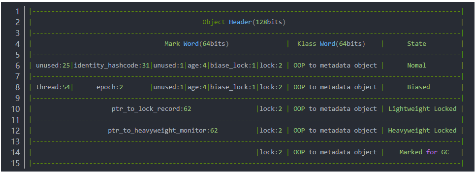
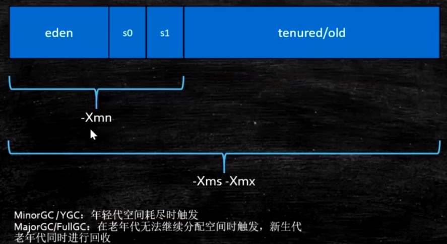

# JVM 学习笔记
---
## 第一章 JVM 基础概念
### 1.1 Java 从编码到执行的过程
.png)

### 1.2 JVM
- Jvm是一种规范，是虚构出来的一台计算机。
- 从跨平台的语言到跨语言的平台
> scala 等语言都会编译成class文件运行在jvm之上
- jvm跟java无关，jvm只与class文件格式有关

> JVM 中一个线程的成本默认是1M空间
### 1.3 Jvm 的实现
- Hotspot
- Jrockit
- J9-IBM
- Microsoft VM
- TaobaoVM
> Hotspot的深度定制版
- LiquidVM
- azul zing
> 最新垃圾回收的业界标杆，速度快，特别是垃圾回收

### 1.4 JVM JRE JDK 关系
.png)

## 第二章 Class File Format
使用Idea的 jClasslib 对照查看一个class file 结构理解

jvm总共有256条指令，其中只有8条指令是原子性的

## 第三章 Class Loading Linking Initializing （类加载和初始化）
jvm默认是懒加载，当需要使用的时候再去加载。
### 3.1 加载过程

- Loading
- Linking
    1. Verfication 验证，验证其是否满足规范是否符合Class file format格式
    2. Preparation 准备
    3. resolution 正式加载
    > 过程详见3.5章节
- initializing
### 3.2 加载层次
自上而下进行实际查找和加载
自底向上检查该类是否已经加载parent方向
***4种类加载器及其负责的加载范围：***
1. Bootstrap
> 加载lib/rt.jar charset.jar等核心类
2. Extension
> 加载扩展jar包，jre/lib/ext/*.jar，或者由-Djava.ext.dirs指定扩展包路径
3. App
> 加载classpath指定的内容，也就是平时开发自己写的类由App加载
4. Custom ClassLoader
> 自定义类加载器

类加载过程
.png)
### 3.3 双亲委派
Jvm是按需动态加载采用双亲委派机制
先是从底向上Custom->App->Extension->Bootstrap检查一遍，再是从顶向下委派加载一遍Bootstrap->Extension->App->Custom
``` java
//源码体现
protected Class<?> loadClass(String name, boolean resolve)
    throws ClassNotFoundException {
    synchronized (getClassLoadingLock(name)) {
        // First, check if the class has already been loaded
        //第一步检查当前类加载器中是否已经加载过，如果没有去父类加载器里面找，这里直接体现了自底向上查找
        Class<?> c = findLoadedClass(name);
        if (c == null) {
            long t0 = System.nanoTime();
            try {
                if (parent != null) {
                    //去父类加载器里面找，注意loadClass，类似于递归查询
                    c = parent.loadClass(name, false);
                } else {
                    //父类加载器中没有找到就去Bootstrap里面找，如果经历了这么一圈后还没有找到开始走下面的c== null
                    c = findBootstrapClassOrNull(name);
                }
            } catch (ClassNotFoundException e) {
                // ClassNotFoundException thrown if class not found
                // from the non-null parent class loader
            }

            if (c == null) {
                // If still not found, then invoke findClass in order
                // to find the class.
                //委派加载开始，判定当前类归谁加载
                long t1 = System.nanoTime();
                //findClass体现了 *** 模板设计模式 ***，他的最原始方法直接回抛出异常，需要子类加载器实现后调用子类的具体实现
                c = findClass(name);

                // this is the defining class loader; record the stats
                sun.misc.PerfCounter.getParentDelegationTime().addTime(t1 - t0);
                sun.misc.PerfCounter.getFindClassTime().addElapsedTimeFrom(t1);
                sun.misc.PerfCounter.getFindClasses().increment();
            }
        }
        if (resolve) {
            resolveClass(c);
        }
        return c;
    }
}

```
为什么要使用双亲委派？
- 主要是类加载安全问题
- 次要是资源问题

### 3.4 混合模式
- 解释器
- JIT （Just-In-Time compiler）
- 混合模式
    1. 混合使用解释器+热点代码编译
    2. 热点代码检测
        - 多次被调用的方法（方法计数器）
        - 多次被调用的循环（循环计数器）
> -XX:compileThreshold=10000  默认的检查热点代码的循环次数
> Xmixed 默认是混合模式，开始解释执行，启动速度较快，对热点代码实行检测和编译
> -Xint 使用解释模式，启动很快执行稍慢
> -Xcomp 使用纯编译模式，执行很快，启动很慢。

### 3.5 Linking 类加载的第一个阶段，静态成员变量的加载过程
#### 3.5.1 Verfication
验证文件是否符合JVM规定
#### 3.5.2 Preparation
静态成员变量赋默认值 （例如 int i = 10,在这个阶段i赋默认值为0，在初始化阶段才会赋值为10）
#### 3.5.3 resolution
将类、方法、属性等符合引用解析为直接引用。常量池中的各种符号引用解析为指针，偏移量等内存地址的直接引用


### 3.6 initializing 初始化
调用类初始化代码，例如构造函数等，给静态成员变量赋初始值

## 第四章 JMM java memory moudle （java的内存模型）
### 4.1 硬件数据一致性
- MESI intel的缓存一致性协议

### 4.2 缓存行（面试会被问到）
读取内存中缓存的时候以cache line为基准向更高级的缓存块中读取，这么做主要是用于提升效率，目前line为 长度为64位。
大概的读取顺序是:
CPU寄存器->CPU L1缓存->CPU L2缓存->CPU L3缓存->机器内存->本地磁盘->远程磁盘。
> 从左向右读取的速度越来越低。并且缓存的空间也会越来越大，因为CPU中本身的寄存器中位置很有限只有4位。

#### 4.2.1 伪共享
位于同一缓存行的两个不同数据，被两个不同的CPU锁定，产生互相影响的伪共享问题。
> 解决伪共享问题：使用缓存行对齐能够提高效率。
```java
// Disruptor 的RingBuffer 源码，为了解决INITIAL_CURSOR_VALUE的缓存行问题，直接定义了7个long。
//人为的组成一个64位空间的缓存行，这样就可以保证同一缓存行中无其他字节数据。这么做虽然加快了速度，但是却多使用了一些内存空间。
public final class RingBuffer<E> extends RingBufferFields<E> implements Cursored, EventSequencer<E>, EventSink<E> {
    public static final long INITIAL_CURSOR_VALUE = -1L;
    protected long p1;
    protected long p2;
    protected long p3;
    protected long p4;
    protected long p5;
    protected long p6;
    protected long p7;
```
### 4.3 乱序问题
是因为CPU层面会指令重排序，所以会出现乱序问题，在java中为了解决乱序问题需要使用volatile（底层是通过Unsafe类实现，Unsafe类的底层是基于CPU的内存屏障来实现）。

### 4.4 内存屏障与Jvm指令
#### 4.4.1 硬件内存屏障
- sfence : save
- lfence : load
- mfence : modify/mix
- lock

#### 4.4.2 JVM级别如何规范（JSR133）
- LoadLoad屏障
- StoreStore屏障
- LoadStore屏障
- StoreLoad屏障

#### 4.4.3 Volatile 是怎么实现的
- class字节码层面
> 在class file formate的access_flag中增加了volatile修饰符
- JVM层面
如下两种情况：读写操作前后分别增加了屏障
    > StoreStroe屏障
    volatile 写操作
    StoreLoad屏障

    > LoadLoad屏障
    volatile读操作
    LoadStore屏障
- OS的硬件层面
windows lock 指令实现
linux 不同于windows

#### 4.4.4 synchronize实现细节
- class字节码层面
> 增加了monitorenter 和 monitorexit 指令，monitorexit可能有多条，其中有专门用于处理运行时异常的。
- JVM层面
C C++ 调用了操作系统提供的同步机制
- OS的硬件层面
X86：lock cmpxchg 等原语

### 4.5 对象的内存布局
#### 4.5.1 创建一个对象的过程
- class load
> 将类加载到class load中
- class Linking （Verfication Preparation resolution）
> 校验class文件格式，给静态成员变量赋默认值
- class initializing 
> 将类的静态成员变量赋初始值，执行静态语句块
- 申请内存
- 成员变量赋默认值
- 调用类的构造函数
    1. 成员变量按顺序赋初始值
    2. 执行构造方法语句

#### 4.5.2 javaAgent 对象在内存中的存储布局
- 普通对象
    1. 对象头 markword 8字节
    2. ClassPointer 指针
    3. 实例数据
    4. padding对齐 8 的倍数

- 数组对象
    1. 对象头 markword 8字节
    2. ClassPointer 指针
    3. 数组长度
    4. 数组数据
    5. padding对齐 8 的倍数

#### 4.5.3 对象头具体包括什么
分为Mark Work（对象信息）和Klass Word（元数据和方法信息）和State（对象状态）

- Mark Word详解
它用于存储对象的运行时记录信息，如哈希值、GC分代年龄(Age)、锁状态标志（偏向锁、轻量级锁、重量级锁）、线程持有的锁、偏向线程ID、偏向时间戳等。Mark Word允许压缩

- Klass 详解
像 Method 、 ConstantPool 都会以成员变量（或指针）的形式存在于klass体系中

- Klass Word OOp模型
> oop模型是 Ordinary Object Pointer （普通对象指针） 

下面我们来分析一下，执行 new A() 的时候，JVM Native里发生了什么。首先，如果这个类没有被加载过，JVM就会进行类的加载，并在JVM内部创建一个 instanceKlass 对象表示这个类的运行时元数据（相当于Java层的 Class 对象。到初始化的时候（执行 invokespecial A::<init> ），JVM就会创建一个

instanceOopDesc对象表示这个对象的实例，然后进行Mark Word的填充，将元数据指针指向Klass对象，并填充实例变量。

根据对JVM的理解，我们可以想到，元数据—— instanceKlass 对象会存在元空间（方法区），而对象实例—— instanceOopDesc 会存在Java堆。Java虚拟机栈中会存有这个对象实例的引用。

- Object Header 图解


Java的对象头在对象的不同的状态下会有不同的表现形式，主要有三种状态，无锁状态，加锁状态，GC标记状态。那么就可以理解Java当中的上锁其实可以理解给对象上锁。也就是改变对象头的状态，如果上锁成功则进入同步代码块。但是Java当中的锁又分为很多种，从上图可以看出大体分为偏向锁、轻量锁、重量锁三种锁状态。

1. Nomal无锁状态(前两位)
2. Biased偏向锁(中间四位)
3. Lightweight轻量锁
4. Heavyweight重量级锁
5. GC状态

### 4.6 java运行时数据区
.png)
#### 4.6.1 各区介绍
- JVM stacks

- Direct Memory(直接内存区)
Jvm可以直接使用操作系统内存，主要用于NIO的零拷贝
- method area(方法区)
    1. Prem Space（<1.8）
    2. Meta Space (>1.8)
    > 以上两个是对方法区的不同实现，取决于jdk版本

#### 4.6.2 线程共享区域
.png)

#### 4.6.3 栈帧 Frame
- Local Variable Table 局部变量
> 
- Operand Stack 操作数栈
> 
- Dynamic Linking
> 
- return address
> 方法a调用了方法b，如果有返回值，b方法的返回值放在什么地方就是return address

## 第五章 GC 调优
### 5.1 GC理论
#### 5.1.1 什么是垃圾
失去引用的对象称之为垃圾

#### 5.1.2 怎么找到垃圾
引用计数的方式：引用值为0时证明无人引用，但是无法解决循环引用的问题。

#### 5.1.3 怎么解决引用计数的缺陷
Root Searching 根可达算法

什么是GC roots
- 线程栈变量
- 静态变量
- 常量池
- JNI指针

#### 5.1.4 常用GC算法
- Mark-Sweep （标记清除）
> 碎片化比较严重
适用于老年代，存活对象较多的时候
- Copye （拷贝）
> 浪费一半的空间
适用于伊甸区，存活对象较少的时候
- Mark-Compress （标记压缩）
> 执行效率偏低
适用于老年代

#### 5.1.5 堆内存逻辑分区
.png)

除了G1 等一些新的垃圾回收器外其他的垃圾回收器的新生代和老年代的大小默认值都是1:3

#### 5.1.6 一个对象从出生到消亡过程
.png)

#### 5.1.7 基本参数作用范围


#### 5.1.8 对象的生命周期及其分配过程
.png)

#### 5.1.9 常用命令
- java -X 输出非标参数
- java -XX PrintFlagsFinal 输出所有的不稳定参数

### 5.2 垃圾回收器
#### 5.2.1 常见的垃圾回收器
.png)
常见组合
- Serial + Serial Old
单线程清理
- PS + PO
多线程清理
- ParNew + CMS

> 概念：stop-the-world (STW) 停顿时间，垃圾回收时都需要进行 STW 操作，只是时间特别短，一般是毫秒级

#### 5.2.2 CMS
并发标记清除垃圾

cms垃圾回收阶段
.png)

cms 缺点：
- mark sweep标记导致的内存碎片化
> 碎片化特别严重的时候就会让Serial Old标记压缩清理压力，导致STW时间特别长

