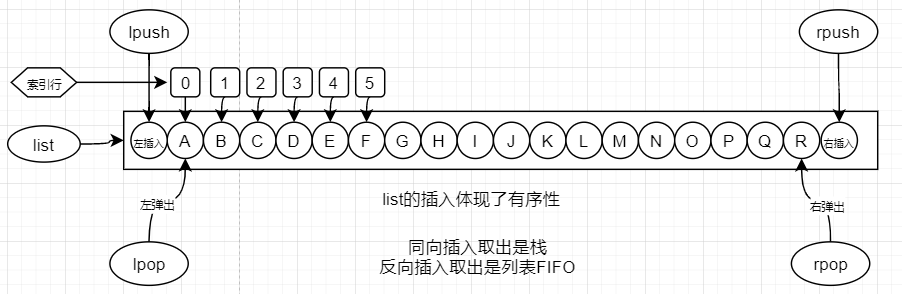
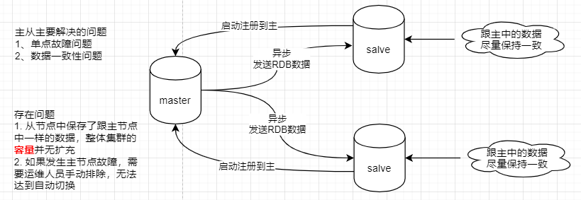

# Redis 学习笔记
---
## 一 基础知识
- 磁盘：
    1. 寻址：ms级
    2. 带宽：G/M/s
- 内存：
    1. 寻址：ns
    2. 带宽：很大
- 索引与数据的关系：

## 二 redis和memcache的区别
- redis提供了丰富的数据类型，同时也提供了数据类型对应的相关操作api
- redis是基于小量结果进行计算可以提升I/O
- memecache 把数据全部存在内存之中，断电后会挂掉，数据不能超过内存大小，但是redis可以实现磁盘持久化
- redis的使用场景会更多。

## 三 redis 与客户端与操作系统的关系
redis 与操作系统之间实现的是epoll模型，多路复用

## 四 epoll 
redis使用的是epoll 多路复用来实现的高吞吐量。
epoll与select的区别就是epoll有一个共享空间，但是select则是每次遍历用户态和内核态查找select绑定了谁。

## 五 redis基础知识
- redis是二进制安全的，汉字都转化为了2进制，一个汉字占用3字节
- redis单线程单进程（使用的是epoll多路复用），因为redis的数据如果全存放在内存中的话，内存的读取效率一般延迟都是ns级别，如果是多线程的话会牵扯到上下文切换，从而影响了读写效率。
- 目前redis单机可支持秒级 10万+请求，官方给出的数据是1.5M次 15万次
### 5.1 redis默认库
- redis默认提供了16个库，从0-15，每个库与每个库之间的数据是隔离的

### 5.2 常用命令
- select dbno 选择数据库
- flushall 删除整库（线上切勿使用）
- ttl 获取key的剩余有效期，返回值为-2过期，返回值-1未设置过期时间，正数表示剩余时间

### 5.2 String 常用命令
- set key 1232 nx (nx如果存在的则不设置，可以用于分布式锁)
- set key 1232 xx (xx 如果不存在则不设置，存在再设置)
- mset 设置多个key和value
- mget 获取多个key的value
- strlen 获取字符串长度
- append 从左侧拼接
- SETRANGE 设置从左侧开始的第几位开始替换字符（setrange key 4 "hello redis"）
- type 查看数据类型
- incr 自增
- decr 自减
- incrby 增加指定值
- decrby 减少指定值
### 5.3 bitmap
位数据结构和命令操作

位操作相对于数据库来说极大的减少了数据存储空间，同时位操作的计算速度也很快
- setbit key offer value 设置key位置和值
- bitcount key start end 统计从起始位置到结束位置的bit的数量，统计数量的原理是bitmap链上对应的位值为1的。
- bitcount key -2 -1 从末尾统计倒数第1 和第2个数据

> 同一个用户365内，多少天登录过。
setbit sean 1 1 
setbit sean 2 1
setbit sean 4 1
bitcount sean 0 -1 (0头 -1尾)

> 一段时间的活跃用户统计
setbit 20200701 1 1
setbit 20200701 2 1
setbit 20200702 1 1
bittop or resultkey 20200701 20200702
bitcount resultkey 0 -1 (0头 -1尾)

### 5.4 list
list存入是有序的，但是list本身不能提供排序功能。排序需要找set
- lpush 从最左边依次放入每个元素
- rpush 从最右边依次放入每个元素
- lpop 从最左边弹出第一个元素
- rpop 从最右边弹出第一个元素
- lrang key start end 查看所有元素
- lrem key count value 如果count为正数表示从左开始移除，如果count复数表示从右移除
- blpop/brpop 阻塞队列弹出元素
- ltrim 去掉指定头尾的元素

> 实现栈操作：lpush lpop 左边放入左边获取或者右边放入右边取出
> 实现先进先出：lpush rpop 或者 rpush lpop

### 5.5 hash
- hset key filed value 设置key属性的值
- hget key filed 获取key 属性值
- hgetall key 获取key中的所有元素及其值
- hdel key filed 删除key中的属性值
- hexists key filed 判断key中的某一个属性是否存在
- hincrby key filed 设置key中某一个属性的值增加或减少一个整数值
- hincrbyfloat key filed 设置key中某一个属性的值增加或减少一个浮点数
- hkeys key 获取key中所有的属性
- hlen key 获取key中属性的个数
- hmget key fileds 获取key中的多个属性的值
- hmset key fileds value 设置key中多个属性的值
- hscan
- hsetnx key filed 设置key中属性值，如果这个属性不存在可以设置成功，存在设置失败
- hvals key 获取key中所有的属性值
- hstrlen key filed 获取key中单个属性的值的长度
- hscan key cursor [MATCH pattern] [COUNT count] 
HSCAN user:1 0 match ag* count 2
扫描user:1 中从头开始的满足ag开头的所有属性及其值，扫描两个

### 5.6 set
存入是无序的，去重。不可以排序。
- sadd 存入元素
- scard 获取set中存放的值数量
- srem 移除元素
- smembers 获取全部元素，但是尽量少用，数据量太大容易引起redis吞吐量的问题
- sinter 获取两个key的交集
- sinterstore 获取两个key的交集并存放到目标key中
- sunion 获取两个元素的并集
- sunionstore 获取两个元素的并集并存放到目标key中
- sdiff 获取两个key的差集
- sdiffstore 获取两个key的差集并保存的目标key中
- sismember 判断key中是否包含某一个元素
- smove 从key中移动一个元素到另外一个key中
- spop 从key中弹出几个值，按照默认从左往右的顺序弹出
- srandmember key 正数 从中随机跳出几个值
- srandmember key 负数 从中随机跳出几个值，可以重复抽出

### 5.7 sorted_set
存入无序，物理存储有序，左小右大，内部有正向索引和逆向索引
最底层使用的是跳表的数据结构。skip list
牺牲了存储空间换取查询速率，新插入元素会随机造层。
- zadd key score member 添加数据
- zcard key 获取key中元素数量
- zcount key min max 获取key中score值在min-max之间的元素数量
- zincrby key no member 给制定的元素score值增加几，可以是正数和负数
- zinterstore resultkey k1 k2 weights aggregate sum|min|max 获取连个key的交集并保存到resultkey中
- zrange key start end withscores 获取所有的元素及其scores值
- zrank key member 获取成员在set中的索引值
- zrem key member 删除成员
- zremrangebyrank key start stop 删除索引从几到几的元素
- zremrangebyscore key min max 删除score值范围内的元素
- zrevrange key start stop 翻转输出set的值，从大到小
- zscore key member 获取成员的score值
- zunionstore 并集查询

### 5.8 管道
管道可以一下子发送多个命令执行，可以降低redis的连接数

### 5.9 pub/sub发布订阅
要求订阅者先启动才可以收到发布者发布的消息

### 5.10 布隆过滤器
解决缓存穿透的问题
如果被穿透缺不存在怎么办，客户端需要增加redis中的key标记为不存在

### 5.11 布谷鸟过滤器

### 5.12 redis作为缓存/数据库的区别
- 缓存数据不是特别重要，可以删除后不影响系统整体运行
- 缓存不是全量数据
- 缓存应该保存热度数据，内存大小有限不能无限存储

#### 5.12.1 key的有效期
- 业务逻辑推动了key应该设置有效期
- 业务运转过程中由于资源问题推动了key会被淘汰
- key无延续时间的策略

***key的淘汰策略***
1. 按照最少使用量淘汰
2. 按照最少使用时间淘汰
3. 随机回收

***key的过期淘汰策略***
1. 被动过期
> 过期后不删除，等你查询时看是否过期，过期了删除。但是会占用内存空间。
2. 主动过期
> 周期轮训删除

#### 5.12.2 redis内存设置多大合适
一般建议设置单机1G-10G的大小，如果特别大的话在持久化处理时会耗时更长

## 六 持久化
### 6.1 RDB 快照副本
- 时点性
触发方式（手动自动触发）
- bgsave 后台运行保存（运行阶段自动备份时选择）
- save 前台阻塞保存（关机维护人工介入选择使用save）
RDB配置-redis.conf文件
- 修改RDB文件名`dbfilename 6379_rdb.rdb`
- 指定RDB文件保存路径`dir /opt/soft/redis5/data`
- RDB备份策略`save <seconds> <changes> save 900 1 save 300 10 save 60 10000`
RDB存在的问题：
- 备份数据会比实际数据少
- 永远只有一个rdb文件。需要每天运维拿出来备份一次

**RDB备份的过程：**
Fork一个子进程，然后使用copy on write 写时复制机制解决子进程和父进程数据冲突问题

### 6.2 AOF 操作日志
Redis的写操作记录到文件中

AOF配置-redis.conf配置
- 打开AOF `appendonly yes`
- 修改AOF文件名 `appendfilename "6379_appendonly.aof"`
- 修改AOF同步策略 `appendfsync always/everysec/no`
- 修改AOF自动压缩的触发条件`auto-aof-rewrite-percentage 100
auto-aof-rewrite-min-size 64mb`

- 优点：丢失数据少
- 缺点：文件体量大，恢复慢
> AOF文件体量大的问题redis的解决方案：
    1. 4.0版本以前使用重写操作完成，删除抵消的命令，合并重复的命令
    2. 4.0版本以后AOF中保存有一份完整的RDB文件+增量的AOF日志
- 缺点：AOF会引起redis性能变慢
> redis的解决方案：
    1. appendfsync always 每一个操作都会记录到AOF文件中 丢失一次操作操作的数
    2. appendfsync everysec 每秒记录一次 丢失一秒内产生的数据
    3. appendfsync no 等着内核的buffer满了，操作系统自动flush。最大会丢失一个buffer的数据

## 七 事务
Redis 事务不支持回滚。开启事务是将所有的客户端发送的Redis命令放入一个队列中。
1. 事务是一个单独的隔离操作：事务中的所有命令都会序列化、按顺序地执行。事务在执行的过程中，不会被其他客户端发送来的命令请求所打断。
2. 事务是一个原子操作：事务中的命令要么全部被执行，要么全部都不执行。

- MULTI开启事务
- EXEC执行事务
- DISCARD取消事务
> 当执行 DISCARD 命令时， 事务会被放弃， 事务队列会被清空， 并且客户端会从事务状态中退出
- WATCH监控为 Redis 事务提供 check-and-set （CAS）行为
> 被 WATCH 的键会被监视，并会发觉这些键是否被改动过了。 如果有至少一个被监视的键在 EXEC 执行之前被修改了， 那么整个事务都会被取消， EXEC 返回nil-reply来表示事务已经失败

开启事务后的流程
- **MULTI流程**

- **watch流程**

## 八 Redis集群

### 单机存在的问题
- 单点故障
- 容量有限
- 访问压力

### 集群的原则
**AKF：**

**CAP：** 一致性（C） 可用性（A） 分区容错性（P）

https://baike.baidu.com/item/CAP%E5%8E%9F%E5%88%99/5712863?fr=aladdin

### 8.1 主从复制

默认情况下主节点支持读写，从只支持读。如果修改了replica-read-only yes/no可以支持从节点写操作

**优点：**
- 解决了单机的单点故障
- 降低了主节点的读写压力

**缺点：**
- 需要人工维护故障问题
- 并无解决数据容量问题

**主传送给从RDB的方式**
repl-diskless-sync no/yes
- 网络直接传输RDB（网络传输速度大于磁盘存储速度时选择）
- 先落到主的磁盘然后从磁盘再发送到从节点（磁盘存储速度大于网络传输时使用）

**增量传输**
repl-backlog-size 1mb

### 8.2 哨兵模式
在原先主从复制的基础上增加了监控的哨兵，用于在发生故障后自动的选举新的主节点，达到故障自动切换的目标。

**优点：**
- 解决了主从手动解决故障的问题
- 解决了单机的单点故障
- 降低了主节点的读写压力

**缺点：**
- 并无解决数据容量问题

### 8.3 集群模式

Redis 集群没有使用一致性hash, 而是引入了哈希槽的概念.

默认有16384个槽位(0~16383)，每个key通过CRC16校验后对16384取模来决定放置哪个槽.集群的每个节点负责一部分hash槽。

这种结构很容易添加或者删除节点. 比如如果我想新添加个节点D, 我需要从节点 A, B, C中得部分槽到D上. 如果我想移除节点A,需要将A中的槽移到B和C节点上,然后将没有任何槽的A节点从集群中移除即可. 由于从一个节点将哈希槽移动到另一个节点并不会停止服务,所以无论添加删除或者改变某个节点的哈希槽的数量都不会造成集群不可用的状态.

**优点：**
- 解决了数据容量的问题，不会造成全局数据失效和洗牌

缺点
- 数据分治问题
> 聚合操作很难实现，事务不好保证，如果涉及多个key可能会分配到多个分片里面，无法保证多节点事务。
解决方案：在key前面增加前缀. ex: set {XX}k1 123，要想都在一个集群上就在key前面增加`{XX}`一样的前缀即可。
- keys 命令无效

**集群模式下常用命令**
- 连接集群某一个节点 redis-cli -c -port 注意需要增加`-c` cluster的意思。
- 检查集群信息 `redis-cli --cluster check`
- 集群信息`redis-cli --cluster info`
- 查看帮助`redis-cli --cluster`
- 创建集群`redis-cli --cluster create host:ports`

## 冷知识
- 只有windows才会有AIO，linux没有。
- 数据库引擎统计列表网站
https://db-engines.com/en

- linux查看帮助手册命令
man 命令