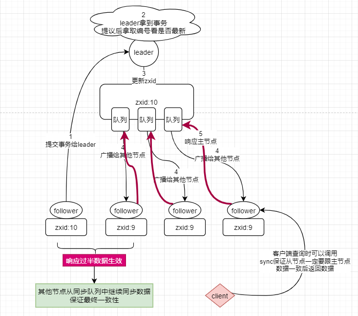

# zookeeper 学习笔记
---

## 第一章 什么是zookeeper
ZooKeeper是用于分布式应用程序的协调服务，它公开了一组简单的原语，分布式应用程序可以基于这些原语来实现用于同步，配置维护以及组和命名的更高级别的服务。它的设计易于编程，并使用了按照文件系统熟悉的目录树结构命名的数据模型。它以Java运行。

## 第二章 设计目标
- 简单 - 数据基于内存存储，底层基于文件树结构并且共享给各个节点和客户端访问
- 支持集群 - 支持集群部署，主从模式，leader模型。
- 有序性 - 所有的事务基于一个全局有效的有序数字序列，实现全局有序性。
- 快 - 基于内存，并且要求读写比为10:1的环境，要求保存的数据不能超过1M，建议数据为几b或几kb。
> **数据不能超过1M的原因：**为了让zookeeper有更好的性能表现，降低节点的数据容量可以减少在高并发情况下的带宽压力和IO压力。

**集群特点**
- 高可用
- 快速自我修复（官方给出200ms即可选主）

## 第三章 数据模型（Data model）和分层命名空间（hierarchical namespace）
Nodes and ephemeral nodes（节点和临时节点）
> **临时节点:** 基于会话（session）级别的临时节点可用于分布式锁的实现。
> **持久节点:** 节点上可以保存数据并持久保存。

## 第四章 保证性
- 顺序性 - 来自客户端的更新是严格按照发送的顺序执行
- 原子性 - 要么成功要么失败，不会有其他状态。
- 单个镜像 - 可以保证集群所有节点上的数据仅此一份且保证一致
- 可靠性 - 数据发生更新后将会覆盖更新到所有节点。
- 低延时 - 确保系统的数据镜像在特定时间内一定是最新的。

## 第五章 集群

### 5.1 整个集群的两个状态
- 有主状态

- 无主状态：集群刚启动或者leader挂掉了

### 5.2 集群节点的三个状态
- looking 选举中
- leader 主节点
- follower 从节点

### 5.2 集群主节点的选举
1. 新集群刚启动
只要所有启动节点过半就会选择myid最大的节点为主节点。
例如有5个节点的zk集群，过半启动就是3台启动，这时整个集群就会处于一个可用状态，可以实现选举，这时myid最大的节点为主节点

2. 主宕机重新选举
- 3888端口实现两两通讯
- 只要任何人投票都会触发那个准leader发起自己的投票
- 如果zxid相同，myid大的是主。

### 5.3 事务的同步过程

### 5.4 协议
- paxos
基于消息传递的一致性算法，目前为止唯一的分布式一致性算法。paxos有一个前提，就是完全信任计算机环境无任何问题，网络可信不会被入侵。

- ZAB
基于paxos的高级实现

## 第六章 API 连接

- 使用客户端连接zk时默认是异步连接，在连接时使用countdownlatch阻塞连接

