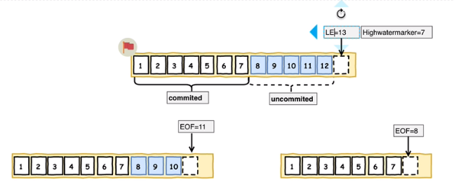

# Kafka 概念
***
是一个分布式、支持分区的（partition）、多副本的（replica），基于zookeeper协调的分布式消息系统，它的最大的特性就是可以实时的处理大量数据以满足各种需求场景：比如基于hadoop的批处理系统、低延迟的实时系统、storm/Spark流式处理引擎，web/nginx日志、访问日志，消息服务等等。他本身是使用scala + java开发。

## 第一章理论概念详解

### 1.1 Kafka特点
- 高吞吐量、低延迟
> 每秒可以处理几十万条消息，它的延迟最低只有几毫秒，每个topic可以分多个partition, consumer group 对partition进行consume操作。
- 可扩展性
> 支持在线的热扩展
- 持久性、可靠性
> 本地文件存储，并且支持多节点备份机制
- 容错性
> 基于zk 选举特性，集群保证节点的可用性
- 高并发
> 支持数千个客户端同时读写

### 1.2 使用场景
- 大数据流式处理
- 日志收集
- 消息系统
- 用户活动跟踪

### 1.3 基本概念
- broker
> Kafak每个集群的一个节点称之为一个broker
- topic
> 用于存放message的队列称之为topic,每个topic可以分为多个分区，每个分区又可以有多个副本
- partion
> 队列分区，主要用于提升消息消费的吞吐量。每一个partion都有一个offset用来记录当前分区的偏移量
- replication
> 分区的备份，均匀的分配在各个broker的同一个topic中，主要用来应对kafka集群的高可用性


### 1.4 Kafka集群的概念


### 1.5 Kafka中生产者和消息日志
客户端在发送消息时，kafka默认会按照key的hash值均匀的存放在每一个分区中，保证消息消费的高吞吐量。


### 1.6 消费者
Kafka中一个topic可以被多个消费者所消费，每个消费者只需要记录自己的消费offset偏移量值即可


### 1.7 消费者组
consumer group是kafka提供的可扩展且具有容错性的消费者机制。组内可以有多个消费者或消费者实例(consumer instance)，它们共享一个公共的ID，即group ID。组内的所有消费者协调在一起来消费订阅主题(subscribed topics)的所有分区(partition)。每个分区只能由同一个消费组内的一个consumer来消费


> 通过消费者组的概念可以得知，当增加partion分区数时不光可以增加存储容量也可以提升消费效率

### 1.8 高性能之顺序写入&mmp（memory map file）
kafka的消息虽然是保存在磁盘上，但是他底层的实现可以保证其有每秒百万级的数据写入。这种特性也使得kafka在日志处理等海量数据场景下广泛使用，Kafka会把收到的消息都写入到硬盘中，防止数据丢失，为了优化写入速度Kafka采用了顺序写入和MMFile技术

以为磁盘是机械磁道机构，每次写入都会寻址->写入的操作。其中寻址是一个机械动作，也是最耗时的。为了提高提盘的读写效率，kafka采用的是顺序写入IO。顺序写入也无法保证大数据量的快速写入为了解决此问题kafka充分利用了现代操作系统的分页存储来提高IO。Kafka会将数据全部写入到内存映射文件中，然后操作系统会将内存映射文件直接刷新到磁盘上，极大的降低了IO使用率。一般情况下64位的内存映射文件可以到达20G


### 1.9 数据读取Zerocopy
Kafka数据消费时采用的是零拷贝机制，减少了内核空间到用户空间的拷贝，以此来提升读性能


### 1.10 事务
- producer事务
> 需要引入一个全局唯一的TransactionID，并将Producer获得的PID和TransactionID绑定，这样当Producer重启后就可以通过正在进行的TransactionID获取原来的PID。
为了管理Transaction，kafka引入了一个新的组件Transaction Coordinator。Producer就是通过Transaction Coordinator交互获得TransactionID对应的任务状态。Transaction Coordinator还负责将事务写入Kafka的一个内部Topic(_topic_)，这样即使整个服务重启，由于事务状态得到保存，进行中的事务状态可以得到恢复，从而继续进行。

>> 如果会话ID Pid发生了变化事务就需要重新进行，原来的将不可用

### 1.11 ISR
in-sync replicasct (ISR)同步副本，意思是和leader保持同步的follower集合，ISR中规定一段时间内同步服务一直无法保证follower节点和leader节点数据保持一致就会将其从ISR列表中剔除。
> replica.lag.time.max.ms (默认30s)规定时间内主节点会检测从节点是否从主节点中同步数据

### 1.12 高水位(Height watermark)
早起版本的kafka集群中分区与分区间同步数据使用的高水位的概念进行的。但是高水位同步存在数据丢失和数据不一致的问题


### 1.13 LEO（Leader Epoch）
从0.11版本后kafka升级为使用leader Epoch来实现数据同步机制。

## 第二章 具体使用

### 2.1 生产者
#### 2.1.1 序列化
在使用Kafka发送接收消息时，producer端需要序列化，consumer端需要反序列化，在大多数场景中，需要传输的是与业务规则相关的复杂类型，这就需要自定义数据结构


### 2.2 消费者
- 分配策略
> RoundRobin （轮训，按照消费者组划分）

> Range (按照主题划分，默认规则)

> 消费者数量发生变化时，会触发分配策略

- 消费者与partions的关系
> 消费者数量 <= partions 的数量，保证没有消费者处于闲置状态

### 2.3 消费者组

### 2.3 过滤器 

### 2.4 ack和重试机制
默认情况下生产者在30秒内没有收到kafka服务器ack时，会启用无限的重试提交机制。但是重试时会存在一个问题就是数据会被重复发送，例如网络故障后，在单位时间内生产者启用了重试，会无限的给服务端发送重复消息，造成消息重复。

### 2.5 幂等写
为了解决在ack机制下导致的重复发送问题，kafka支持幂等写。kafka会给每一个生产者颁发一个ProducerID。对于每个ProducerID，Producer发送数据的每个Topic和Partition都对应一个从0开始单调递增的SequenceNumber值。如果重复发送一条消息时SequenceNumber和ProducerID一致则证明是同一条信息，这时kafka就不会将这条信息存入。如果启用了kafka的幂等写，则生产者的ack必须是-1。


## 第三章 使用场景

### 3.1 常用命令
> 启动命令：`./kafka-server-start.sh -daemon ../config/server.properties`

### 3.2 场景验证
#### 1、 分布式部署时同属于一个consumer group 的消费者会重复消费吗？
> 不会重复消费，同属于一个consumer group的消费者不会重复消费消息
#### 2、分布式部署时不属于一个consumer group 的消费者订阅同一个topic时会重复消费吗？
> 会重复消费，两个组的消费者会互补干扰各自消费


## 第四章 spring boot 中操作kafka
### 4.1 kafkaTemplate 生产真


### 4.2 KafkaListener 消费
- 手动提交offset
application.yml 配置文件增加
`spring.kafka.consumer.enable-auto-commit: false`
`spring.kafka.listener.ack-mode: manual`

``` java
    //核心代码
    @KafkaListener(topics = "stu_kafka")
    public void printMessage(ConsumerRecord<Integer,String> consumerRecord, Acknowledgment ack){
        System.out.println(consumerRecord.value()+"--"+consumerRecord.offset()+"--"+consumerRecord.partition());
        //手动提交
        ack.acknowledge();
    }
```

> <b>RECORD</b> -- 每处理一条commit一次
<b>BATCH(默认)</b> -- 每次poll的时候批量提交一次，频率取决于每次poll的调用频率
<b>TIME</b> -- 每次间隔ackTime的时间去commit
<b>COUNT</b> -- 累积达到ackCount次的ack去commit
<b>COUNT_TIME</b> -- ackTime或ackCount哪个条件先满足，就commit
<b>MANUAL</b> -- Listener负责ack，但是背后也是批量上去
<b>MANUAL_IMMEDIATE</b> -- Listener负责ack，每调用一次，就立即commit

<b>除开MANUAL和MANUAL_IMMEDIATE，其他模式都是由spring根据约定的条件控制提交，我们在代码中调用consumer.commitAsync()是不起作用的。</b>

