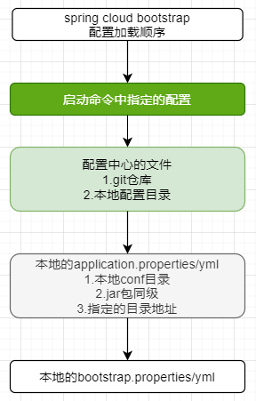
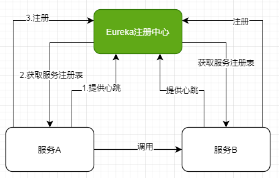
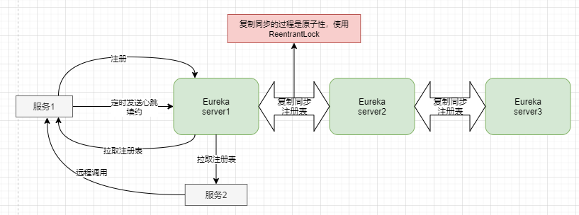
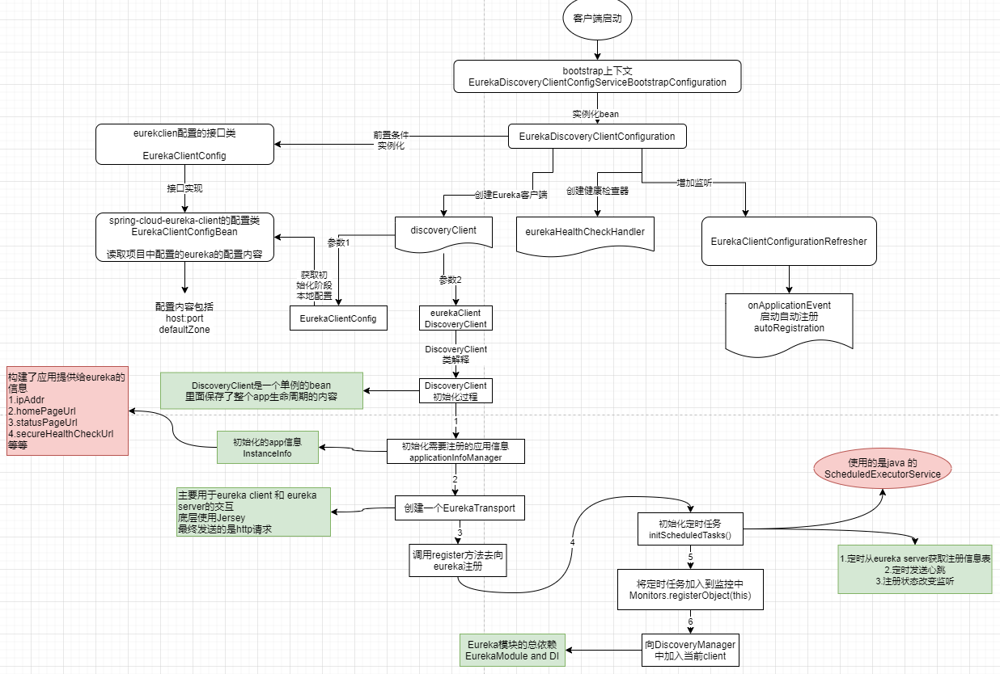
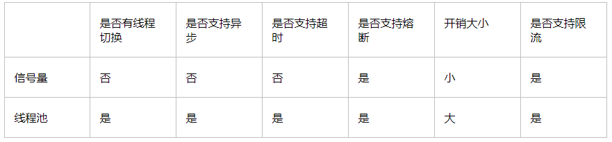
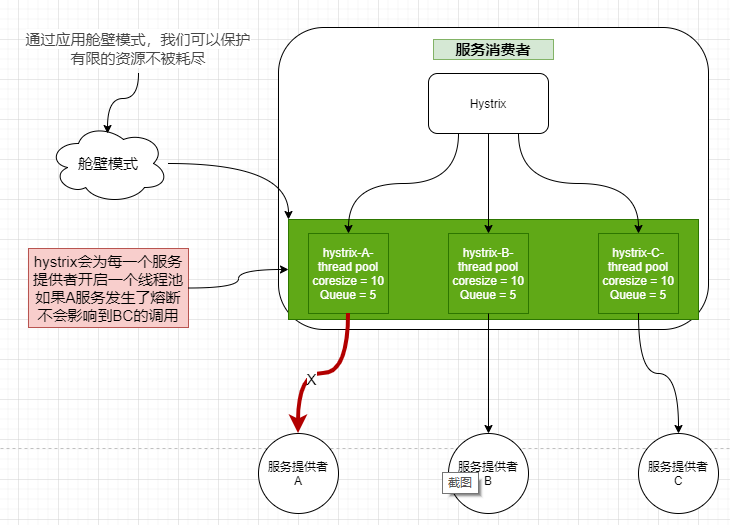

# Spring cloud 学习笔记

作者：kyrie 学习笔记如有转发请标注出处

## 第一章 微服务
### 1.1 微服务的特性
- 独立运行在自己的进程中
- 一个服务只关注自己的独立业务
- 轻量的通讯机制Restful api
- 可以使用不同的语言开发
- 一系列独立服务共同构建起整个系统
- 全自动部署机制

### 1.2 微服务优点
- 独立部署，不依赖其他服务，耦合低
- 易于开发和维护，业务清晰，代码量少。模块易于开发和维护
- 启动快
- 局部修改容易
- 按需伸缩
- 职责专一
- 代码复用
- 便于团队协作

### 1.3 微服务缺点
- 分布式固有的复杂性：容错，网络延时，调用关系，分布式事务
- 分布式事务的挑战，每个服务都有自己的数据库，多个服务间调用时事务处理麻烦
    1. 刚性事务
    2. 柔性事务，最终一致性
- 接口调用成本高，网路IO，接口更改调用方可能会跟随更改
- 测试难度提升，一个接口的变更所有的调用方都要测试。
- 运维要求高。

### 1.4 设计原则
- 单一职责 ： 关注整个系统功能中单独，有界限的一部分
- 服务自治：可以独立开发，测试，部署，构建，运行
- 轻量级通讯原则：跨平台，跨语言，RestApi AMQP
- 粒度把控：与自己的实际结合，随业务进行调整。

## 第二章 spring cloud context
spring cloud 在启动的时候会创建一个bootstrap的引导上下文(bootstrap非bootstrap.yml，而是spring cloud的引导上下文)，他启动后会开始从外部环境进行配置文件的加载，例如配置中心，通过bootstrap加载进来的配置优先级最高，不会被本地的配置覆盖，加载的顺序大概如下：



## 第三章 注册中心

### 3.1 为什么有注册中心
传统应用中，组件之间的调用有规范的接口，可以实现多个模块之间的互相协作，当使用微服务后，服务实例的网络地址和数量可能动态变化，原来的的传统模式再也无法满足服务变化带来的问题，这时候就需要一个中心化的组件来进行服务的登记和管理。
### 3.2 主要目的
实现服务治理，管理服务所有的服务信息和状态
### 3.3 好处
不用关心有多少提供方，只管调用接口即可。
### 3.4 常见的注册中心有
- eureka
- consul
- nacos
- zookeeper
### 3.5 服务注册包括两部分
- 服务器端
- 客户端

### 3.6 Eureka的介绍
- 是Netflix的一个组件
- 是一个基于RestApi的服务
- 是一个用于服务发现和注册的组件
- 包括server端和client端
- 屏蔽了server和server的交互细节

#### 3.6.1 服务和Eureka的关系


#### 3.6.2 Eureka集群间的关系及Peer之间的通讯原理
Eureka各个节点都是平等的，没有ZK中角色的概念， 即使N-1个节点挂掉也不会影响其他节点的正常运行。

Eureka 集群之间是会互相同步服务注册表的，以此保证集群各个节点间的注册表数据的一致性，但是这个一致性是弱一致性，因为节点间通讯会使用Http请求，网络本身就不是非常可靠。

Peer之间的通讯会通过一个单线程进行的
``` java
static <ID, T> TaskExecutors<ID, T> singleItemExecutors(final String name,
                                                            int workerCount,
                                                            final TaskProcessor<T> processor,
                                                            final AcceptorExecutor<ID, T> acceptorExecutor) {

        return new TaskExecutors<>(new WorkerRunnableFactory<ID, T>() {
            @Override
            public WorkerRunnable<ID, T> create(int idx) {
                //创建一个singleTask 的WorkerRunable 类进行peer间的注册表同步
                return new SingleTaskWorkerRunnable<>("TaskNonBatchingWorker-" + name + '-' + idx, isShutdown, metrics, processor, acceptorExecutor);
            }
        }, workerCount, isShutdown);
    }

```



#### 3.6.3 端点列表
**常用端点:**
- 注册 - POST `/eureka/v2/apps/appID`,返回值204
- 删除 - DELETE `/eureka/v2/apps/appID/instanceID`,返回值200

> 端点api详见
https://github.com/Netflix/eureka/wiki/Eureka-REST-operations


#### 3.6.4 Eureka 客户端的原理和注册过程




#### 3.6.5 Eureka 服务端的原理

#### 3.6.6 元数据
- 标准元数据
主机名、IP地址、端口号、状态页和健康检查等信息，这些信息都会被发布在服务注册表中，用于服务之间的调用

- 自定义元数据
使用eureka.instance.metadata-map配置，这些元数据可以在远程客户端中访问，但是一般不改变客户端行为，除非客户端知道该元数据的含义。比如可以用于灰度发布。

``` yml
eureka:
  instance:
    hostname: localhost
    metadata-map:
      user.name: wangrui
      user.pass: wangrui
      version: 1.2.0.1
```

#### 3.6.7 Eureka 的自我保护
默认情况下，如果Eureka Server在一定时间内（默认90秒）没有接收到某个微服务实例的心跳，Eureka Server将会移除该实例。但是当网络分区故障发生时，微服务与Eureka Server之间无法正常通信，而微服务本身是正常运行的，此时不应该移除这个微服务，所以引入了自我保护机制。

> **官方解释:** 自我保护模式正是一种针对网络异常波动的安全保护措施，使用自我保护模式能使Eureka集群更加的健壮、稳定的运行。

**工作原理**
如果在15分钟内超过85%的客户端节点都没有正常的心跳，那么Eureka就认为客户端与注册中心出现了网络故障，Eureka Server自动进入自我保护机制，此时会出现以下几种情况：

1. Eureka Server不再从注册列表中移除因为长时间没收到心跳而应该过期的服务。
2. Eureka Server仍然能够接受新服务的注册和查询请求，但是不会被同步到其它节点上，保证当前节点依然可用。
3. 当网络稳定时，当前Eureka Server新的注册信息会被同步到其它节点中

**自我保护开关**
一般情况下开发测试环境建议关闭自我保护机制。并且缩短心跳检测时间，以此来达到快速剔除的目的

``` yml
# 服务端配置
eureka:
    server:
    enable-self-preservation: false/true
    # 每隔多少秒检测一次心跳（默认60*1000）
    eviction-interval-timer-in-ms: 3000

# 客户端配置
eureka:
  instance:
    # 多少秒向服务端发送一次心跳（默认30）
    lease-renewal-interval-in-seconds: 3
    # 上一次心跳开始计时一直到超过这个时间未接受到客户端心跳就将其剔除，这个值一定要大于lease-renewal-interval-in-seconds，不然一定会造成误剔除。(默认90)
    lease-expiration-duration-in-seconds: 10
```

- false 关闭自我保护
> 如果关闭了自我保护，eureka server发现服务没有心跳时一定会将其剔除

#### 3.6.8 多网卡解决
一般情况下我们的生产环境只有一个网卡对外提供服务`eh0`,但是机器本身现在都支持多个网卡`eh1,eh2....`。eureka client向服务端注册时首先默认选择hostname的注册方式。但是有时候我们的主机并不一定会通过hostname的方式进行通讯，而是选择固定ip的方式，为了解决此问题，eureka支持多网卡的配置。解决方案如下几种：

- 指定固定ip
``` yml
eureka:
  instance:
    # 使用固定ip
    ip-address: 127.0.0.1
    # 注册时忽略主机名
    prefer-ip-address: true
```

- 指定固定的主机名为固定的ip
``` yml
eureka:
  instance:
    hostname: localhost
```
- 忽略指定的网卡
``` yml
spring:
  cloud:
    inetutils:
      ignored-interfaces: eh0
```

- 通过启动命令指定
``` shell
java -jar xxx.jar --spring.cloud.inetutils.preferred-networks= #需要设置的IP地址
或者
java -jar xxx.jar --spring.cloud.inetutils.ignored-interfaces= #需要过滤掉的网卡
```

#### 3.6.9 健康检查
在未启用健康检查的时候你知道服务的状态是什么样，但是你不知道服务对应的数据库等其他组件的健康状况。如果此时你的数据库宕机了，但是应用层面还是现实可用，但其实应用已经不可用

启用健康检查后，actuator组件会提供更多组件的健康信息，当app注册到eureka中时，eureka会根据各种健康信息决定当前应用是否可用。

``` yml
eureka:
  client:
    # 启用健康检查
    healthcheck:
      enabled: true
```
> 如果app端设定了server.servlet.context-path属性，应该再次指定健康检查的path`instance.health-check-url-path`路径。

#### 3.6.10 监听事件
Eureka server 中5种事件
- `EurekaInstanceCanceledEvent` 服务下线事件
- `EurekaInstanceRegisteredEvent` 服务注册事件
- `EurekaInstanceRenewedEvent` 服务续约事件
- `EurekaRegistryAvailableEvent` 注册中心可用事件
- `EurekaServerStartedEvent` EurekaServer启动事件

**自定义监听事件**
``` java
@Component
public class MyEvent {

    @EventListener
    public void myEvent(EurekaServerStartedEvent event){
        System.out.println("eureka 服务启动了：-----"+event.getSource());
    }
}
```

#### 3.6.11 eureka 核心配置类
- `EurekaServerConfig` Eureka server的相关配置
- `EurekaInstanceConfig` Eureka client的相关配置
- `EurekaClientConfig` Eureka client和server端交互的配置

> 以上类都是接口模板，具体的实现每个版本都不一样

#### 3.6.12 Eureka 缺陷
在CAP原则中，Eureka更加注重的是A(高可用)原则，同时其集群间采用的`http`的方式进行通讯，并且各自有自己的一个服务注册表，相对来说服务注册数据的一致性无法得到可靠的保证。所以一定要保证应用处于一个极其可靠的网络环境中。


#### 3.6.13 Eureka的优化
- 服务端优化
    1. 多机部署时`defaultZone`要随机打乱。因为eureka注册拉取实例时会首先选择`defaultZone`的第一个实例地址进行。如果超过三个以上的eureka实例，只需要将前三个地址随机打乱，其他的注册地址不需要，因为eureka注册时只会重试三次。超过三次就直接失败了。
    2. 关闭三级缓存，如果是服务较少的情况下建议关闭三级缓存，因为三级缓存是二级缓存通过定时任务的方式进行同步的，默认30秒同步一次。关闭后可以减少数据不一致的问题的产生。如果在服务特别多的情况下，建议缩短二级缓存到三级缓存的同步时间。
    3. 减少剔除服务间隔
    4. 关闭自我保护，如果必要开启时，按照实际情况修改自我保护阈值

- 客户端优化
    1. 减少刷新注册表间隔
    2. 减少发送心跳间隔


### 第四章 Ribbon 调用

#### 4.1 负载策略
内置的负载策略都是基于`AbstractLoadBalancerRule`的具体实现

- `RoundRobinRule` 轮训，按照可用服务实例进行轮训调用
```java
//轮训算法,compareAndSet cas操作。
int nextServerIndex = incrementAndGetModulo(serverCount);
private int incrementAndGetModulo(int modulo) {
    for (;;) {
        int current = nextServerCyclicCounter.get();
        int next = (current + 1) % modulo;
        if (nextServerCyclicCounter.compareAndSet(current, next))
            return next;
    }
}
```
- `RandomRule` 随机选择，在可用列表里面随机挑选一个
``` java
//源码体现
int index = chooseRandomInt(serverCount);

protected int chooseRandomInt(int serverCount) {
    return ThreadLocalRandom.current().nextInt(serverCount);
}
```
- `WeightedResponseTimeRule` 权重轮训，RoundRobinRule的高级实现
- `BestAvailableRule` 最低并发策略。

#### 4.2 如何处理无用的服务
- 更新最新的服务列表
- Iping

#### 4.3 基于Eureka的使用方式
1. 自定义一个RestTemplate
``` java
/**
* spring boot 1.4之后RestTemplate需要手动定义
*/
public class RestTemplateConfig {

    @Bean(name = "restTemplate")
    @LoadBalanced
    public RestTemplate getRestTemplate(RestTemplateBuilder builder){
        return builder.build();
    }
}
```
2. 直接注入使用`restTemplate`
```java
@RequestMapping(value = "/version")
public String getVersion(){

    String result = restTemplate.getForObject("http://KYRIE-KAFKA-PRODUCER:9000/version",String.class);
    return result;
}
```

### 第五章 Feign + Hystrix调用

#### 5.1 feign调用过程
1. 加入feign + Hystrix依赖
``` xml
<dependency>
    <groupId>org.springframework.cloud</groupId>
    <artifactId>spring-cloud-starter-openfeign</artifactId>
</dependency>
<dependency>
    <groupId>org.springframework.cloud</groupId>
    <artifactId>spring-cloud-starter-netflix-hystrix</artifactId>
</dependency>
<dependency>
    <groupId>org.springframework.cloud</groupId>
    <artifactId>spring-cloud-starter-netflix-hystrix-dashboard</artifactId>
</dependency>
```

2. 启动类上增加 `@EnableFeignClients @EnableHystrix` 注解
``` java
@SpringBootApplication
@EnableEurekaClient
@EnableFeignClients
@EnableHystrix
@EnableHystrixDashboard
public class KyrieApiApplication {

    public static void main(String[] args) {
        SpringApplication.run(KyrieApiApplication.class, args);
    }

}
```

3. 增加feign客户端接口和熔断配置类
```java
@FeignClient(name="KYRIE-KAFKA-PRODUCER",fallback = KafkaFeignServiceImpl.class)
public interface KafkaFeignService {

    @RequestMapping(value = "/version",method = RequestMethod.GET)
    String getVersion();
}

/**
 * 这个类用来给feign客户端实现熔断备份使用
 */
@Component
public class KafkaFeignServiceImpl implements KafkaFeignService {
    @Override
    public String getVersion() {
        return "{我熔断了}";
    }
}
```

4. 开启feign客户端熔断开关

```yml
feign:
  hystrix:
    # feign 客户端启用熔断
    enabled: true
```

> hyxtris 的属性配置类为 `HystrixCommandProperties`

#### 5.2 feign 原理

#### 5.3 feign的常用配置


### 第六章 Hystrix 原理

#### 6.1 隔离策略
- THREAD 线程隔离
默认是10个线程的线程池
`HystrixThreadPoolProperties` 类中有设置 `default_coreSize = 10 default_queueSizeRejectionThreshold = 5`
当n个请求线程并发对某个接口请求调用时，会先从hystrix管理的线程池里面获得一个线程，然后将参数传递给这个线程去执行真正调用。线程池的大小有限，默认是10个线程，可以使用maxConcurrentRequests参数配置，如果并发请求数多于线程池线程个数，就有线程需要进入队列排队，但排队队列也有上限，默认是 5，如果排队队列也满，则必定有请求线程会走fallback流程。
线程池模式可以支持异步调用，支持超时调用，支持直接熔断，存在线程切换，开销大。

- SEMAPHORE 信号量隔离
默认是10个信号量
`HystrixThreadPoolProperties` 类中有设置 `default_executionIsolationSemaphoreMaxConcurrentRequests = 10`
如果并发请求数多于信号量个数，就有线程需要进入队列排队，但排队队列也有上限，默认是 5，如果排队队列也满，则必定有请求线程会走fallback流程，从而达到限流和防止雪崩的目的。
信号量模式从始至终都只有请求线程自身，是同步调用模式，不支持超时调用，不支持直接熔断，由于没有线程的切换，开销非常小


**对比图**


#### 6.2 舱壁模式



### 第七章 QPS优化
#### 提高并发数据
- 多线程
- 增加连接数 Tomcat redis mysql
- 服务在必要时横向扩展
- 优化代码执行效率

#### 减少响应时间
- 异步（数据最终一致性）流量削峰
- 缓存
- 数据库优化
- 大数据量分页返回
- 减少服务间的调用链
- 如果必要使用长连接