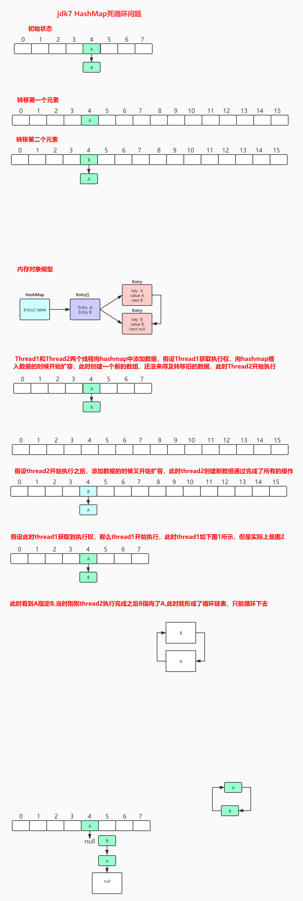

# 问题总结
---

## 20200819
### 1、Kafka重平衡有哪些原因
- 消费者组中的消费者数量增减
- 在线的热扩展partion
- 消费者组订阅的topic数量发生变化

- 由于网络抖动`session.timeout.ms`的时间内Kafka未收到消费者组的心跳信息，导致被剔除。
- 消费者处理业务花费的时间超过了`max.poll.interval.ms`设置的间隔时间，未及时的ack，导致被剔除。
- `heartbeat.interval.ms`心跳检测时间超过了`session.timeout.ms`导致无法正常的心跳续约。

### 2、多态的理解
多态是指程序中定义的引用变量所指向的具体类型和通过该引用变量发出的方法调用在编程时并不确定，而是在程序运行期间才确定。

多态发生的必要条件就是：继承、重写、向上转性

多态时有一个很重要的特性`向上转性`，子类可以调用到父类中定义的方法和属性，但是父类无法调用子类中的方法和属性，包括重写的父类方法在内。

java中可以实现多态的方式有：继承+接口

### 3、Redis hash槽采用了什么算法来分配的key。
采用了CRC16算法

Redis中内置了16384个哈希槽，当新增一个key时，Redis首先会对key进行CRC16运算得出一个结果然后再跟16348取模运算获得key应该存储的hash槽的位置。

### 4、Redis中如何查看占用空间较大的hash key
- 通过`redis-rdb-tools`工具
- 通过`Redis Data Reveal`工具

### 5、查看Redis集群状态的命令是什么
- cluster info
- cluster nodes

## 20200820
### 1、Kafka防止消息重复消费
- 手动提交offset
- 启用幂等写，保证同一条消息只发送一次，防止因为生产者重试机制产生多条一致的消息
    > 幂等写原理，同一个生产者给同一个分区中发送消息时，kafka会给当前消息增加一个唯一id，如果id一致则不提交。
- 数据在业务上增加唯一主键，消费者消费成功后将数据的唯一主键数据库中，每次消费前查询保证数据唯一性消费

### 2、数据库事务的隔离级别
- `读未提交` 可以读取未提交的数据，容易产生脏读/幻读/不可重复读。
- `读提交` 只能读到提交的数据，Oracle默认使用的是读提交。
- `可重复读` 是MySql的默认隔离级别。
- `串行化` 数据库的最高隔离级别，性能较差。

>脏读：读取到了其他未提交的事务阶段提交的数据
幻读：两次读取产生的记录条数不一致
不可重复读：同样的条件，读取过的数据，再次读取出来发现值不一样了。

### 3、数据库事务的特性 `ACID`
- `原子性` 一次事务范围内的操作要么全部成功，要么全部失败
- `一致性` 保证事务只能是提交前状态和提交后状态，而不会产生中间提交状态
- `隔离性` 不同事务之间资源是互相隔离，不干扰的。
- `持久性` 事务一旦提交，状态就会持久保存，不会发生变化

### 4、Redis分布式锁
分布式锁的原理就是多人共用同一把锁，谁持有谁执行业务。业务过程执行完成后删除锁。
Redis 2.6 版本后官方推荐使用 `set key value ex 10 nx ` 实现分布式锁。

 ***Redis分布式锁中存在的问题***
 - `死锁` 为了防止死锁产生在加锁时设置锁超时时间和当前锁的持有人
 - `越权删除锁` 一般情况下业务执行完毕后会选择手动释放锁，在释放时如果自己业务过程耗时超过了锁的超时时间，释放锁时存在错误释放其他线程的锁，这时应该先查询一下锁的持有者再选择删除。这个过程中如何保证查询和删除锁是一个原子操作呢，防止查询时锁有效，还未执行删除方法时锁失效了又导致的锁释放错误，这个时候可以选择使用lua脚本执行get 和 del命令，充分利用了Redis原子性的特点。

### 5、Jdk1.7 hashmap死循环问题
单线程时不存在

多线程操作时，如果恰巧遇到两次操作都引起了hash扩容，扩容时会产生rehash将原先存储的节点进行重新的hash计算。

### 6、jdk1.8中链表节点为多少时转为红黑树
jdk8中hashmap的底层数据结构发生改变，改为数组+链表+红黑树存储元素

当链表节点大于8且map中元素个数大于64时会将链表转为红黑树。这么做主要是为了提升查询效率，红黑树的查询时间复杂度是O(logn)，其他情况下是进行扩容。

